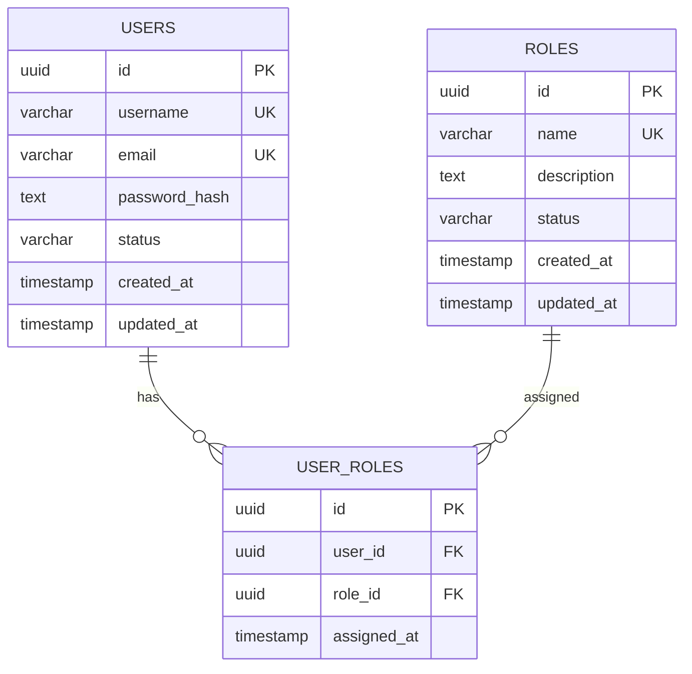

# Diagrama Entidad-Relación

```mermaid
erDiagram
  USERS {
    uuid id PK
    varchar username UK
    varchar email UK
    text password_hash
    varchar status
    timestamp created_at
    timestamp updated_at
  }
  ROLES {
    uuid id PK
    varchar name UK
    text description
    varchar status
    timestamp created_at
    timestamp updated_at
  }
  USER_ROLES {
    uuid id PK
    uuid user_id FK
    uuid role_id FK
    timestamp assigned_at
  }
  USERS ||--o{ USER_ROLES : has
  ROLES ||--o{ USER_ROLES : assigned
```

Restricción UNIQUE(user_id, role_id)
